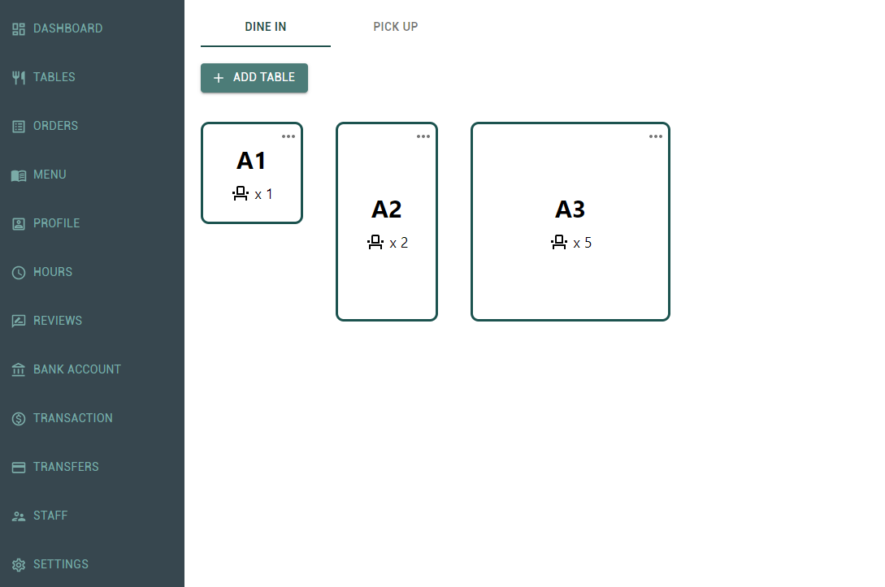

## Table Management System - (React & Redux)

## Overview
This table management system allows users to create the visualized floor plan by adding, editing, and removing tables. It also has the functionality to manage orders for dine-in and pick up. 

## Demo Link
Here is a working live demo: https://xwang2021.github.io/restaurant/

## Features

**Add Table under Dine In**  
Tables are shown in different sizes based on user input

**Update table settings for an existing table**  
Data validation was added on all the forms before letting user click save button

**Modify order details for an existing table**  
Users can update the quantity for each order item in this interface, and the subtotal price will change as well

**Manage List of Pickup Orders** 

## Built With
- React 
- Redux
- JavaScript
- CSS
- HTML
- Material UI
